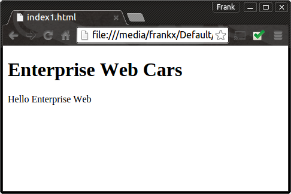
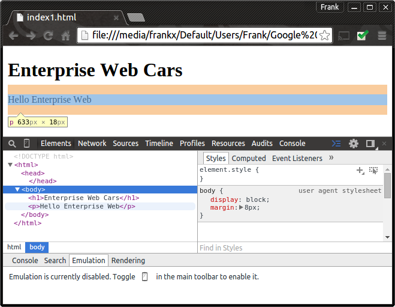
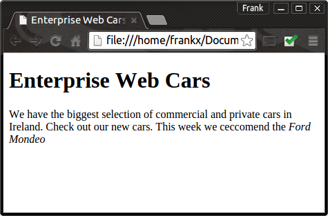
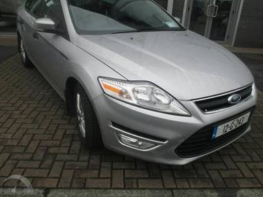
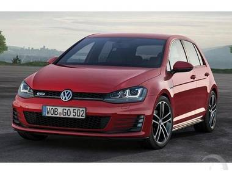

# Environment Setup

It is assumed you are using your own personal laptop/device with a standard, reasonably up-to-date operating system (e.g. Linux/IoS/Windows).

## Browser
In order to complete the lab you need a browser that supports HTML5. Most up to date browsers do. We recommend to use Google Chrome as the lab instructions are based on this.

## Editor
You will need a suitable editor to write your code. It's assumed you're using VSCode with Live Server extension as per the lab last week. If you wish, you can use another editor.

## HTML Folder Structure
Create a new folder called *lab3* and create two more folders called *images*,*stylesheets* inside *lab2*. It should look something like this:

~~~
+-- lab3
|   +--images
|   +--stylesheets
~~~

You're now ready to create a simple web page!

## A Really Basic HTML Page
Create a new file in  the folder *lab3* called *index.html*. Enter the following HTML code and save.

~~~html
<!DOCTYPE html>
<html>
  <head>
  </head>
  <body>
    <h1>Enterprise Web Cars</h1>
    <p>Hello Enterprise Web</p>
  </body>
</html>
~~~
Now view this page in your browser by using the open option in the file menu of the browser. You should see the HTML rendered as follows:



You can see the general structure of the page and how the related to the mark up in the HTML code. As you did last week, open Developer Tools in Chrome and you can view HTML source and the rendered page at the same time. In the Elements tab, clicking on each element will result in the corresponding area in the page to be hightlighed. This will allow you to inspect your HTML code.



## Adding Content

We'll now add some content to the page. Using the lecture slides and the web as a reference, try the following:

- Add a ``<title>`` element with the value "Enterprise Web Cars" inside the ``<head>`` element.
Replace the value of the ``<p>`` element in the body with the following text:

~~~text
We have the biggest selection of commercial and private cars in Ireland. Check out our new cars. This week we recommend the <em>Ford Mondeo</em>. What a car!
~~~

- Save and check the changes work in the browser. You should now see the title and some more content on your page.



## Images and Links
We will now add some images and links to our web application. Save the following images into the images folder inside the *lab3* folder (right-click on image and select "Save image as..."):






Now create a new folder, *stock*, in the *lab3* folder. In the *stock* folder create the a new file, *cars.html*, that contains the following html:
 
~~~html
<html>
  <head>
    <title> Enterprise Web Cars: New Cars </title>
  </head>
  <body>
    <h2>Ford Mondeo</h2>
    <p>
      
      <p>Traction control, Radio/CD/MP3, Outside temperature meter, Multi function steering wheel, Isofix child seat anchor points, Immobiliser,                    Heated screen.</p>
    </p>
    <h2>Volkswagen Golf</h2>
    <p>
      
     <p>ABS, Driver Airbag, Passenger Airbag, Side Airbag, Child Locks, Deadlocks, Flat Tyre Indicator, ISO Fix, Multiple Airbags, Side Impact Protection, Xenon Headlights. </p>
    <p>
      <a href="../index.html">Home</a>
    </p>

  </body>
</html>
~~~

Notice how the ``src`` attributes in the ```` elements use relative addressing to reference the image files. Now return to your *index.html* page and update the paragraph text to include a link to this page as follows:

~~~html
 We have the biggest selection of commercial and private cars in Ireland. Check out our <a href="stock/cars.html"> new cars</a>. This week we recommend <em>the Ford Mondeo</em>. What a car!
~~~

Create another folder, *about* in the *lab3* folder. In the stock folder create the a new file, *directions.html*, that contains the following html:

~~~html
<html>
  <head>
    <title>Enterprise Web Cars: Directions</title>
  </head>
  <body>
    <h1>Directions</h1>
    <p>Take the 305 S exit to Waterford go 0.4 mi</p>
    <p>Continue on 305 go 12 mi</p>
    <p>Turn right at Structure Ave N go 0.6 mi</p>
    <p>Turn right and head toward Structure Ave N go 0.0 mi</p>
    <p>Turn right at Structure Ave N go 0.7 mi</p>
    <p>Continue on Structure Ave S go 0.2 mi</p>
    <p>Turn right at SW Presentation Way go 0.0 mi</p>
    <p>
      <a href="../index.html">Home</a>
    </p>
  </body>
</html>
~~~

In *index.html*, enter the following code after first paragraph to create a "Directions" section on the page:

~~~html
 <h2>Directions</h2>
    <p>
      You'll find us right in the center of Waterford. If you need help finding
      us, check out our
      <a href="about/directions.html">detailed directions</a>.
      Come join us!
    </p>
~~~

Now try the web application out, making sure the links work and images appear correctly.

## Menu Bar
The site should offer clear navigation. While it's possible to have links in the text, we will also create a "nav bar" at the top of the screen with the same links.

Add the following HTML code just inside the <body> element. This contains an unordered list of links to the other pages in the site.

~~~html
<nav>
    <a href="#">Home</a> |
    <a href="stock/cars.html">Cars</a> |
    <a href="about/directions.html">Directions</a> |
</nav>
~~~

Add a navigation bar to the other two pages also. You will need to adjust the links relative to each page.

## Favicon Icon

Finally, we'll add a Favicon icon to our pages. A Favicon is a favorite icon associated with a particular page or organisation. It's the icon that appears on the browser tabs beside the title. Download the following icon to your *images* folder.


Now, in the <head> element, link to the icon by entering the following link element:

~~~html
 <link rel="icon" href="images/favicon.ico">
~~~

As with the menu bar, replicate this in the other pages. We'll now move on to apply some style to our page using CSS...