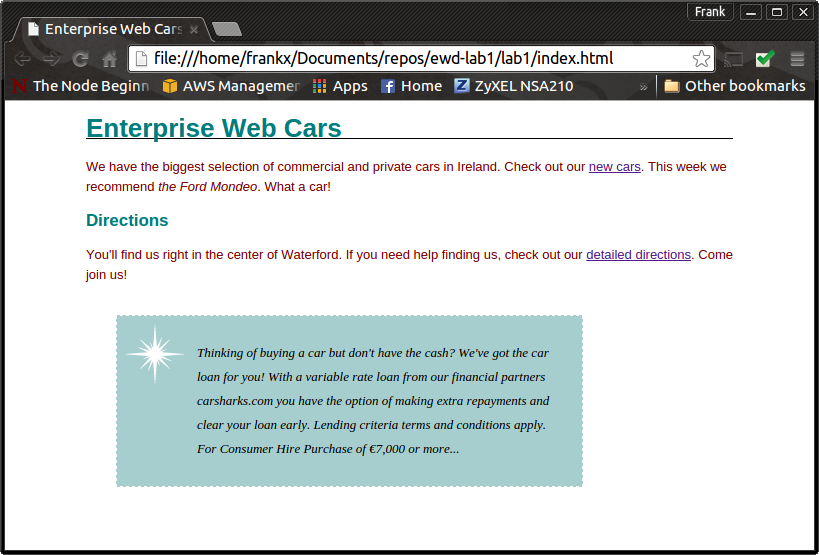

# Cascading Style Sheets

HTML elements alone will give us a structured page - however it will have a very plain and unattractive appearance. To introduce 'style' into a page we need another language - Cascading Style Sheets (CSS). This is a different language from HTML and is usually stored in a separate file - the stylesheet.

## CSS

Create a new file called *style.css* and save it into the *stylesheets* folder you created in the last step. Add the following lines of code to the file and save:

~~~css
p
{
  color: maroon; /* Change text colour to maroon
}
~~~

Bind this file into your pages by 'linking' to it in the the ``<head>`` element of each page. Add the following line of code into the head element:

~~~html
    <link type="text/css" rel="stylesheet" href="stylesheets/style.css" />
~~~

Now have a look at the *index.html* page in the browser - you should notice that the text in the paragraph is now maroon in colour. Add the link element to *cars.html* and *directions.html*. Again you will need to adjust the relative reference for each page.

Add the following rules one at a time a observe the effect:

~~~css
h1, h2
{
  color: #007e7e; 
}

h1
{
  font-size: 200%; 
  border-bottom: 1px solid black;
}

h2
{
  font-size: 130%;
}

  body
{
  width: 80%;  
  margin: 0 auto;
  /*font-family Specifies the font for the element. If he browser does not support the first font, it tries the next font and so on... */
  font-family: Verdana, Helvetica, Arial, sans-serif; 
  font-size:small;
  line-height: 1.6em;
}

li {
    display: inline;  /*displays list items inline instead of block. 
                        Result is nav bar items displayed horizontally.*/
}
~~~

All going well you should end up with your index.html page looking something like this:

If you want, you can explore the css rules by changing the values and observing the results.

## CSS Class Selectors

The class selector allows you to apply syle rules to elements with a specific class attribute. Add the following paragraph element to your index.html page after the last body.

~~~html

Thinking of buying a car but don't have the cash? We've got the car loan for you!   With a variable rate loan from our financial partners carsharks.com you have the option of making extra repayments and clear your loan early. Lending criteria terms and conditions apply. For Consumer Hire Purchase of &euro;7,000 or more...

~~~

In the browser, it will appear with the standard style rules specified for paragraphs:

We want to draw attention to this paragraph in the overall page by applying specific style properties.For example, different font and background colour and add a background image beside the text.

Save the following image, *background.gif*, to the images folder.

Update the ``
`` element by adding a class attribute with the value "finance".

~~~html

~~~

Now open *style.css* and add the following css rule with the appropriate class selector. Notice class selectors begin with a period followed by the class name. This will apply the style rules to all elements with attribute class="finance".

~~~css
.finance
{
  border-color: white;
  border-width: 1px;
  border-style: dashed;

  margin: 30px;
  padding: 25px;
  padding-left: 80px;
  margin-right: 150px;

  background-color: #a7cece;
  background-image: url(../images/background.gif);
  background-repeat: no-repeat;
  background-position: top-left;

  line-height: 1.9em;
  font-style: italic;
  font-family: Georgia, "Times New Roman", Times, serif;
  color: black;
}
~~~

View *index.html* in the browser. See how the finance paragraph is now more prominent. Play around with some of the style rules to understand their effect.

