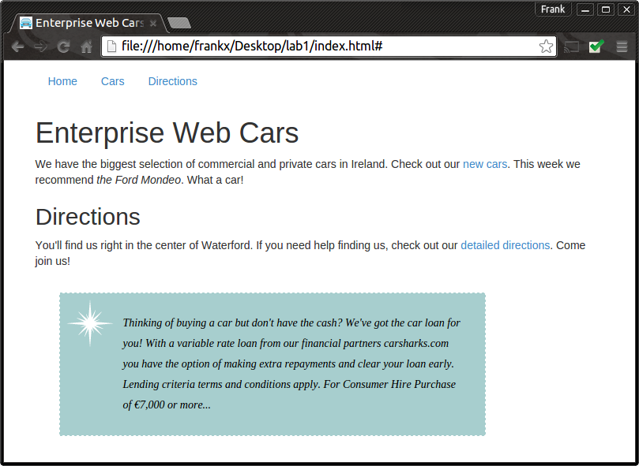
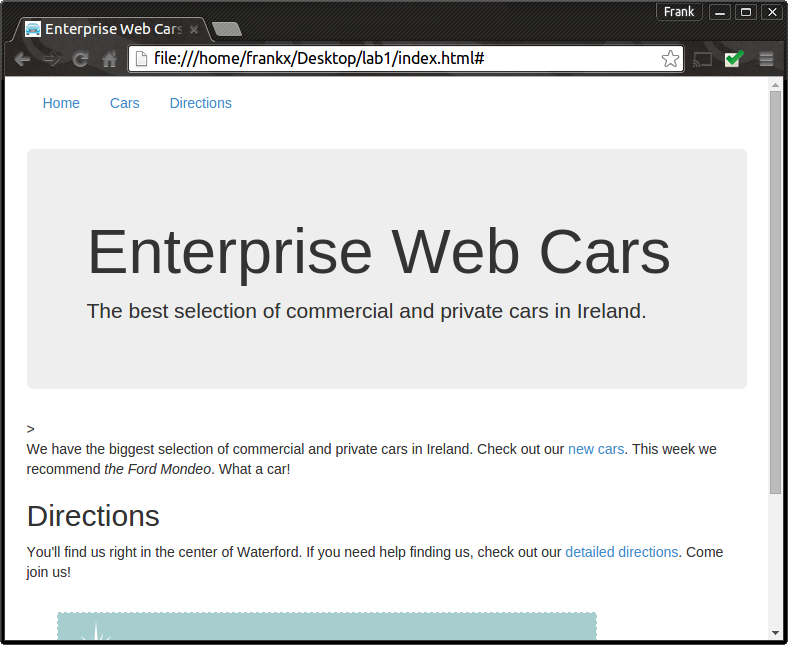
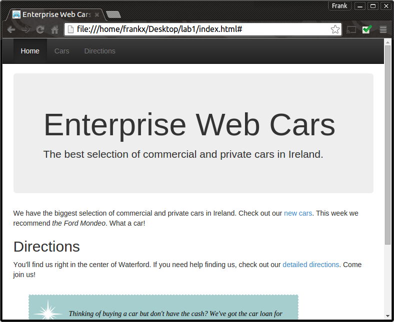

# Bootstrap and Forms

In the last task you created your own custom css style. While this allows for full control over your styling, it can be a long process to develop from scratch. Furthermore, we should be trying to style our pages such that they look good on all devices such as smart phones, tablets etc.

Several frameworks already exist that we can leverage to provide good generic styling that looks good everywhere. In this lab, we'll will use [Bootstrap 3.4](https://getbootstrap.com/docs/3.4/) to improve our simple web site. First we'll link to Bootstrap.

## Linking to Bootstrap
You can link to more than one css style sheet in a page. To bind to the Bootstrap files, add the following into the head element of your pages, just above your own style sheet.

~~~html
   <!-- Bootstrap core CSS -->
    <link href="https://stackpath.bootstrapcdn.com/bootstrap/3.4.0/css/bootstrap.min.css" rel="stylesheet"/>
   <!-- Bootstrap theme -->
    <link href="https://stackpath.bootstrapcdn.com/bootstrap/3.4.0/css/bootstrap-theme.min.css" rel="stylesheet"/>
~~~

Bootstrap also uses some pre-written, core JavaScript libraries that can add a lot of cool features to you page. We can link to JavaScript files by adding the following code at the bottom of your HTML pages (just before the closing ``</html>`` tag.

~~~html
   <!-- Bootstrap core JavaScript
    ================================================== -->
    <!-- Placed at the end of the document so the pages load faster -->
    
    
~~~

You'll notice that your page will look the same. This is because your style settings are overriding bootstrap default styles (e.g. borders).

Next we'll include a viewport meta tag on our page. Bootstrap is designed with mobile devices in mind so to ensure proper rendering and touch zooming. To try to ensure this, insert the following line in the ``<head>`` element.

~~~html
<meta name="viewport" content="width=device-width, initial-scale=1">
~~~

We're going to use a Bootstrap theme to style up this screen so we will use the class attribute to apply bootstrap themes to our HTML.

## Update style.css

Open *style.css* file you created in the CSS section and delete all CSS rules apart from the finance class rule. This will let the general bootstrap style apply to your element. The contents of style.css should now look like this:

~~~css
.finance
{
  border-color: white;
  border-width: 1px;
  border-style: dashed;

  margin: 30px;
  padding: 25px;
  padding-left: 80px;
  margin-right: 150px;

  background-color: #a7cece;
  background-image: url(../images/background.gif);
  background-repeat: no-repeat;
  background-position: top-left;

  line-height: 1.9em;
  font-style: italic;
  font-family: Georgia, "Times New Roman", Times, serif;
  color: black;
}
~~~

## Applying Bootstrap Theme
We will use a ``
`` to apply the showcase theme to the whole document. Put the following div element into the *index.html* page, starting just above the nav bar and ending just before the closing ``</body>`` tag.

~~~html
 

...
...
...
 

</body>
~~~

To make the navigation bar appear across the top of the page, add the following class attributes to the existing ``<nav>`` and ``<ul>`` elements:

~~~html
<nav class="navbar">
    <ul class="nav navbar-nav">
~~~

Now take another look at *index.html* in the browser (you may need to refresh the page). It should look like this:

## Jumbotron

Apply the "jumbotron" style to your heading for a primary marketing message or impact. Insert a new ``
`` around the heading and add a new "marketing message" paragraph as follows:

~~~html

    <h1>Enterprise Web Cars</h1> <!--Already in the page...-->
    
The best selection of commercial and private cars in Ireland.

~~~

As you'll see, this has a substantial effect on the rendered page. Also, resize the browser window and notice how the page adjusts accoordingly. This is a key feature of Bootstrap, enabling it to look good on any device.

## Improve the Nav Bar
Let's improve the Navigation bar by adding a collapsed nav bar button for small screen devices. Replace completely the existing <nav> element with the following:

~~~html
<nav class="navbar navbar-inverse navbar-fixed-top">
      

        

          <button type="button" class="navbar-toggle collapsed" data-toggle="collapse" data-target="#navbar" aria-expanded="false" aria-controls="navbar">
            Toggle navigation
            
            
            
          </button>
        

        

          <ul class="nav navbar-nav">
            <li class="active"><a href="#">Home</a> </li>
            <li><a href="stock/cars.html">Cars</a> </li>
            <li><a href="about/directions.html">Directions</a> </li>
          </ul>
      
 
    

    </nav>
~~~

Go though the code and try to relate to what you see on the screen. In particular, notice what happens the nav bar when you resize the browser window to be quite small (or displayed in a small screes/resolution device such as a smart phone).

You may notice the Nav bar obscures some of the title area. We can remedy this by including the following padding rule in *styles.css*.

~~~css
body {
  padding-top: 70px;
  padding-bottom: 30px;
}
~~~

View in a browser to check the results:

## HTML Form
Finally, HTML forms allow users to enter and submit data via the browser window. We will add a new HTML form that allows users to submit their email address. Again, we can use Bootstrap classifiers to style the form. Enter the following HTML just after the finance paragraph:
~~~html
<form class="form-inline" role="form">
    <label>Send us your email to keep informed about our great deals</label> 
    

    <input  type="email" id="email" class="form-control" placeholder="Enter email"/>
    

    <input type="button" value="Go" onclick="console.log(document.getElementById('email').value)" >
</form>
      ~~
~~~

Notice the use of attributes to include text placeholder. Also, the ``onclick`` attribute contains some JavaScript that, using an element id, will execute when the button is clicked. This output the contents of the email text will be output to the console. Have a look at the Javascript console in Developer Tools in your browser when you click the button. Try to understand the code and how it does this.