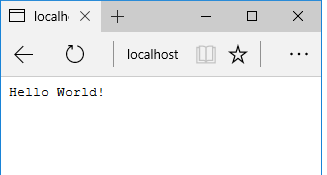

# The "Hello World" HTTP Server

We will be using node as a web API platform. In this step we'll set up a simple HTTP server that responds to every request with the plain text message "Hello World".

## App Config

As discussed in class, one of the advantages of NPM is the wide availability of handy utility packages that follow accepted best practice. App configuration management and environment variables are common to many apps. When using public, cloud based repos you should use best practice approaches to keep sensitive parameters such as private keys and passwords safe.  

Dotenv is a zero-dependency module that loads environment variables from a .env file into *process.env*. In doing this Dotenv stores configuration in the environment separate from code is based on "The Twelve-Factor App" methodology.
This simple application just needs some typical configuration details, for example the port and host info.

- Install Dotenv as a normal, runtime dependency

~~~bash
npm install dotenv --save
~~~

- Create a new file in your application root folder called **.env** and add the following content:

~~~javascript
NODE_ENV=development
PORT=8080
HOST=localhost
~~~

As you could be putting sensitive stuff in the .env file, you should **NOT** commit your .env file to version control. It should only include environment-specific values such as database passwords or API keys used by your server-side API. Also, your production database should have a different password than your development database.

To ensure this is the case, do the following:

- Open *.gitignore* file in you *ewd-labs-2020* folder. Check that it contains the following entry:

~~~json
# dotenv environment variables file
.env
~~~

## HTTP service

- In the *node-lab1* create a new file called  *index.js*  with the following contents:

~~~javascript

// Load the http module to create an http server.
import http from 'http';
import dotenv from 'dotenv'

dotenv.config()

const port = process.env.PORT
// Configure our HTTP server to respond with Hello World to all requests.
const server = http.createServer((req, res) => {
  res.writeHead(200, {'Content-Type': 'text/plain'});
  res.end('Hello  World!');
});

server.listen(port);

// Put a friendly message on the terminal
console.log(`Server running at ${port}`);
~~~

In the first line, we import the http core module and assign it to ``http``. Next we assign the variable  ``server`` from the ``http.createServer(...)`` function. The argument passed into this call is the function that is called whenever an http request comes in.
Finally we call ``server.listen(config.port)`` to tell node.js the port on which we want our server to run.

## Startup Script

We want to specify a script to start up the Node server, which will be the **index.js** file. So our start script would be ``node index.js``. However, since we want the code to be transcoded using  babel and started with nodemon, we will add a **nodemon** execution wrapper and use **babel-node** instead of the node command.

- Find the ``scripts`` property in the *package.json* file and replace it with the following: 

~~~json
....
"scripts": {
    "start": "nodemon --exec babel-node index.js"
  },
....
~~~

To run the server open a terminal/command window in the node-lab1 folder and enter:

~~~bash
npm start
~~~

You should see output smilar to the following:

Now open your browser to 'http://localhost:8080'. You should see the following:

The connection function is invoked with a **req** and **res** object. The **req** object represents the HTTP request and is a readable stream that emits 'data' events for each incoming piece of data (like a form submission or file upload). The ***res*** object represents the HTTP response and is used to send data back to the client. In our case we are simply sending a 200 OK header, as well as the body 'Hello World'.

Leave the app running for the next section.

## Nodemon in Action

Now that your node app is running using Nodemon, any saved changes to your source code(index.js) will cause the app to restart automatically.

- Change ``index.js`` to return "Hello EWD!" in the response and take a look at the terminal. You should see the console output indicating a restart. However, you will require a refresh in the browser to see the new "Hello EWD!" message.