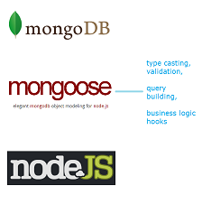

# Set up

We will continue to develop an API for the MovieDB that will be able to drive the React App you completed in the labs. 
To speed up the process and align more closely to the MovieDB API and the React App from previous labs, download the following Starter Code for this lab and place it into your **ewd-api-labs-2020** repo you created in the last lab.

- Update the ``.env`` in the route folder and add your authentication key for the Movie DB that you used in the React labs :

```
NODE_ENV=development
PORT=8080
HOST=localhost
SWAGGER_DOC=../movie-api-yaml/swagger.yaml
TMDB_KEY=<YOUR_AUTH_KEY>
```

- Run ``npm install`` followed by ``npm start`` to check it launches successfully.

- Use Postman to check a few of the routes:


Once it's up and running, we can now add a User to the API and persist using MongoDB and Mongoose

## Mongoose & MongoDB Setup



You can need to create a MongoDB in one of two forms: Installed Locally or Cloud-based. This lab was developed using Mongo Cloud: 

### Mongo Cloud

- Go to  https://cloud.mongodb.com/


- create a free tier cluster in Amazon Ireland Region. *Follow the instructions for a free tier **
- Make sure to follow all the steps to create the cluster. Once complete, get the connection string for your MongoDB as shown below:


- It is risky to have configuration parameters such as user-names, passwords, and instance specific parameters "hard coded" into your javascript programs. In this exercise you will externalise these parameters into the ".env" file. Add the **mongoDb connection string** to the end of your ``.env`` file in the root folder of the express app. 

```bash
mongoDB=mongodb+srv://....
```

### Local MongoDB
If you want to use a local db running on your laptop, do the following:

+ Download and install Mongodb by selecting the relevant installer for your OS: https://www.mongodb.com/download-center/community

Follow the instructions and accept all defaults.

Open the  command line in the directory where you want to put your db directory and enter the following commands:

```bash
mkdir db
mongod -dbpath db
```

This should create your db directory and start the Mongodb service on your local host.

- Add the **mongoDb URL** to the end of your ``.env`` file in the root folder of the express app. 

```bash
mongoDB=mongodb://localhost:27017/movies_db
```

### Mongoose

+ Install Mongoose in your lab project directory for the Express app (**DONT** install it in the React app directory) 

```bash
npm install -save mongoose
```
